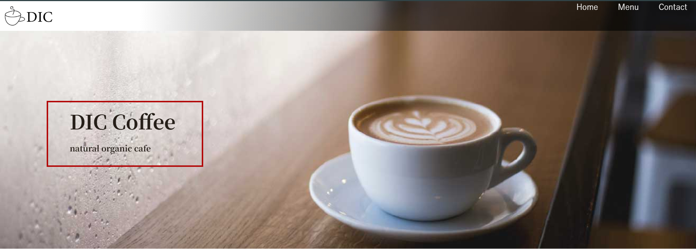
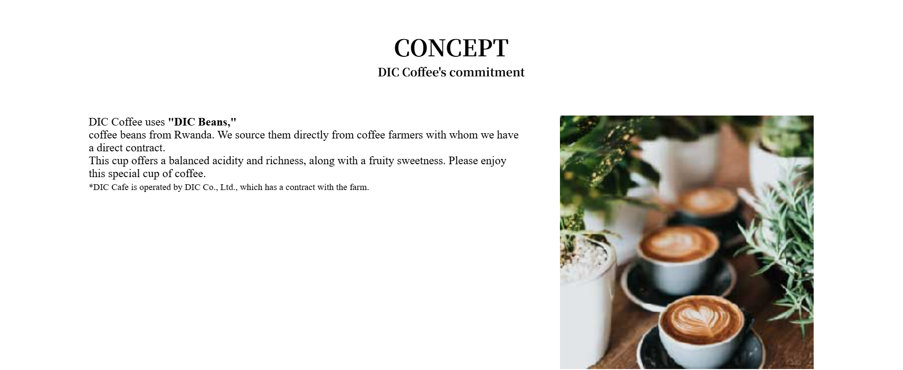
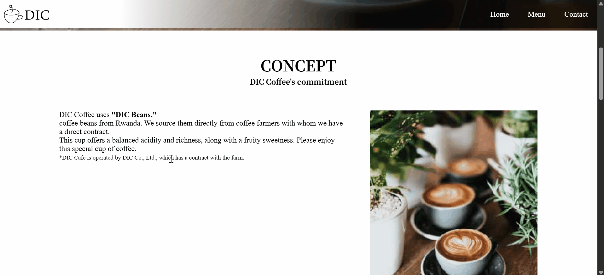
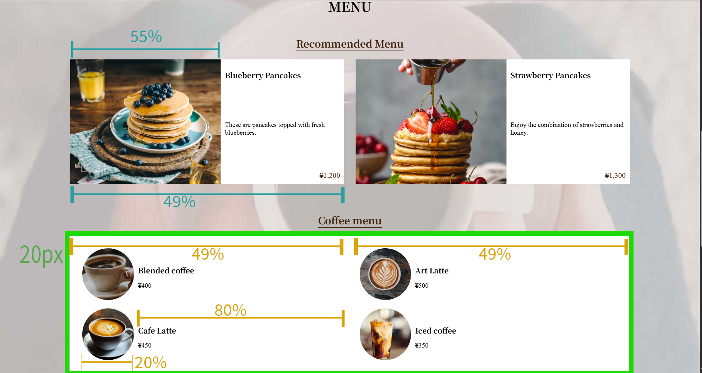
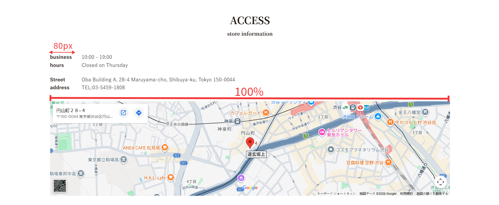
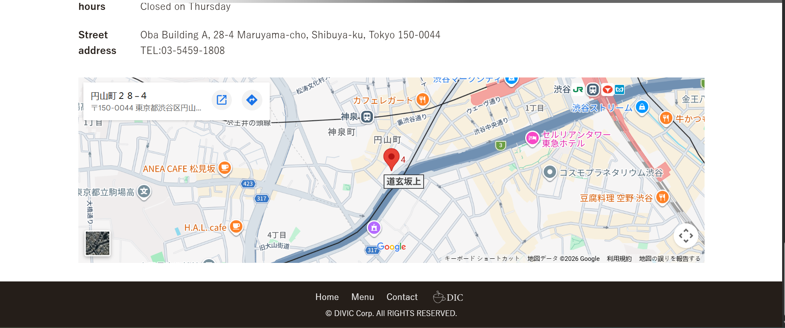


# Sample site imitation

## Purpose of the HTML/CSS Basic Grammar Series Assignment

Series assignment are for determining if you have achieved the goals of the series.

**Goals of the HTML/CSS Basic Grammar Series**

* Can code static websites

## Problem

In this assignment, you will be asked to design the header (key visual), CONCEPT section, MENU section, ACCESS section, and footer, which have not been laid out yet, according to the requirements of what you have learned so far.  
Edit the code in the `index.html` and `main.css` files to meet the passing requirements.

## Preparation

If you haven't downloaded the image files yet, You can download the image from [Image storage location for assignments](https://github.com/diveintocode-corp/web_html_grammer)​

If you have not created a`normalize.css`file, please create a new one and copy and paste the code in the [normalize.css](https://github.com/diveintocode-corp/web_html_grammer/blob/master/css/normalize.css) location

Please change the code of `index.html` and `main.css` file created by the text so far to the following code respectively.

[index.html]

```html
<!DOCTYPE html>
<html lang="ja">
  <head>
    <meta charset="utf-8"/>
    <title>
      DIC cafe
    </title>
    <link href="css/normalize.css" rel="stylesheet"/>
    <link href="css/main.css" rel="stylesheet"/>
    <link href="https://fonts.googleapis.com/css2?family=Noto+Serif+JP:wght@400;700&amp;display=swap" rel="stylesheet"/>
  </head>
  <body>
    <header>
      <nav class="header_nav">
        <a class="logo" href="index.html">
          
        </a>
        <ul class="global_nav">
          <li>
            <a class="global_nav_item" href="index.html">Home</a>
          </li>
          <li>
            <a class="global_nav_item" href="#menu">Menu</a>
          </li>
          <li>
            <a class="global_nav_item" href="contact.html">Contact</a>
          </li>
        </ul>
      </nav>
      <div class="key section_inner">
        <h1>
          DIC Coffee
        </h1>
        <p>
          natural organic cafe
        </p>
      </div>
    </header>
    <section>
      <article class="section_inner">
        <div class="section_title">
          <h1>
            CONCEPT
          </h1>
          <p>
            DIC Coffee's commitment
          </p>
        </div>
        <p>
          Coffee from DIC Coffee uses coffee beans from Rwanda
          <strong>
            "DIC Beans"
          </strong>
          .
          <br/>
          We purchase from coffee farmers who have a direct contract.
          <br/>
          It is a cup that you can feel the fruity sweetness with the balanced acidity and richness. By all means, have a special cup
                    Please enjoy.
          <br/>
          <small>
            ※DIC Cafe is contracted and operated by Daibic Corporation with the farm.
          </small>
        </p>
        
      </article>
      <article class="section_inner">
        <h1 class="section_title" id="menu">
          MENU
        </h1>
        <section>
          <div class="center">
            <h1 class="menu_title">
              Recommended menu
            </h1>
          </div>
          <ul>
            <li>
              <h2>
                Blueberry pancakes
              </h2>
              <p>
                A pancake topped with fresh blueberries
              </p>
              <p>
                ¥1,200
              </p>
              
            </li>
            <li>
              <h2>
                Strawberry pancake
              </h2>
              <p>
                Enjoy the collaboration between strawberries and honey
              </p>
              <p>
                ¥1,300
              </p>
              
            </li>
          </ul>
        </section>
        <section>
          <div class="center">
            <h1 class="menu_title">
              Coffee menu
            </h1>
          </div>
          <ul>
            <li>
              <h2>
                Blended coffee
              </h2>
              <p>
                ¥400
              </p>
              
            </li>
            <li>
              <h2>
                Latte art
              </h2>
              <p>
                ¥500
              </p>
              
            </li>
            <li>
              <h2>
                cafe latte
              </h2>
              <p>
                ¥450
              </p>
              
            </li>
            <li>
              <h2>
                Ice coffee
              </h2>
              <p>
                ¥350
              </p>
              
            </li>
          </ul>
        </section>
      </article>
      <article class="section_inner">
        <div class="section_title">
          <h1>
            ACCESS
          </h1>
          <p>
            store information
          </p>
        </div>
        <dl>
          <dt>
            business hours
          </dt>
          <dd>
            10:00 - 19:00
            <br/>
            Closed on Thursday
          </dd>
        </dl>
        <dl>
          <dt>
            Street address
          </dt>
          <dd>
            Oba Building A, 28-4 Maruyama-cho, Shibuya-ku, Tokyo 150-0044
            <br/>
            TEL:03-5459-1808
          </dd>
        </dl>
        <iframe allowfullscreen="" aria-hidden="false" height="450" src="https://www.google.com/maps/embed?pb=!1m18!1m12!1m3!1d3241.8625569899887!2d139.6922821152582!3d35.65575778020021!2m3!1f0!2f0!3f0!3m2!1i1024!2i768!4f13.1!3m3!1m2!1s0x60188b55bb707eff%3A0x5f04575eb7aca63e!2z44CSMTUwLTAwNDQg5p2x5Lqs6YO95riL6LC35Yy65YaG5bGx55S677yS77yY4oiS77yUIE9iYSBCbGQuIEHppKg!5e0!3m2!1sja!2sjp!4v1589613763992!5m2!1sja!2sjp" style="border:0;" tabindex="0" width="600">
        </iframe>
      </article>
    </section>
    <footer>
      <nav>
        <ul>
          <li>
            <a href="index.html">Home</a>
          </li>
          <li>
            <a href="#menu">Menu</a>
          </li>
          <li>
            <a href="contact.html">Contact</a>
          </li>
          <li>
            <a href="index.html">
              
            </a>
          </li>
        </ul>
      </nav>
      <p>
        © DIVIC Corp. All RIGHTS RESERVED.
      </p>
    </footer>
  </body>
</html>
```

[main.css]

```css
@charset "utf-8";

html {
  height: 100%;
}

body {
  position: relative;
  padding-bottom: 75px;
  min-height: 100%;
}

li {
  list-style: none;
}

p,
ul {
  margin: 0;
  padding: 0;
}

div,
li {
  box-sizing: border-box;
}

.header_nav {
  background: linear-gradient(90deg, #fff 20%, rgba(0, 0, 0, .6) 60%);
  display: flex;
  height: 60px;
  justify-content: space-between;
  align-items: stretch;
  position: fixed;
  top: 0;
  width: 100%;
}

.global_nav_item {
  color: #fff;
  text-decoration: none;
  display: flex;
  align-items: center;
  padding: 0 20px;
}

.global_nav_item:hover {
  background: #fff;
  color: #42210b;
}

.global_nav {
  display: flex;
  align-items: stretch;
}

.logo {
  width: 120px;
  display: flex;
  align-items: center;
}

.logo img {
  width: 100%;
}

.section_inner {
  padding: 50px 10% 30px;
}

.key {
  height: 500px;
  background: center / cover no-repeat url("../images/sample_key.jpg");
  font-family: 'Noto Serif JP', serif;
  font-weight: bold;
}

.key h1 {
  font-size: 2.5rem;
}

.section_title {
  font-family: 'Noto Serif JP', serif;
  font-weight: bold;
  text-align: center;
  margin-bottom: 50px;
}

.menu_title {
  display: inline-block;
  font-family: 'Noto Serif JP', serif;
  font-size: 1.5rem;
  color: #42210b;
  border-bottom: solid #42210b 1px;
  margin-bottom: 20px;
}

.center {
  text-align: center;
}

.coffee_menu_image {
  width: 20%;
  border-radius: 50%;
}
```

## Acceptance requirements

### header (key visual)

* To display the title and subtitle in the top and bottom centre as shown in the image below



### CONCEPT section

* The layout should be such that the text is on the left and the images on the right.
* Text should be 60% wide and images should be 35% wide.



### MENU section

* Display `sample_menu_bg.jpg` in the `dic_cafe/images` directory in the background
* To be displayed in such a way that it remains fixed even when scrolling, as in the image below


* The layout of each menu should, as a minimum, look like the image below  

  We will leave it to you to specify margins and text other than that of the image.

### ACCESS section

* `<dt>` and `<dd>` elements should be side by side
* The layout of each menu should, as a minimum, look like the image below  

  GoogleMap can be as short as you like, as long as the width is 100%.

### footer

* The background color should be`#251e19` and the text color should be white..
* The height of the `footer` should be 75px
* The menu list and logo mark should be side by side and displayed in the center of the left and right of the `footer`.
* The copyright should be displayed in the center of the left and right of the `footer`​

  

## how to submit assignment

1. Create a new remote repository on GitHub (repository name is optional)
2. Source code in the repository you created. `push` be just about to
3. Follow these steps to submit assignment  
   ①. Click on "assignment" in the sidebar.  
   ii. Click on "Submit assignment".  
   3). Select assignment to submit.  
   ④. Fill in the URL of the GitHub repository you created in this assignment (\*Fill in the Heroku or AWS URL in assignment where you are required to deploy to the production environment).  
   ⑤. Provide any remarks or other information you wish to convey.  
   ⑥. For assignment, which requires submission of images, attach images  
   ⑦. Click "Submit" and submit assignment

